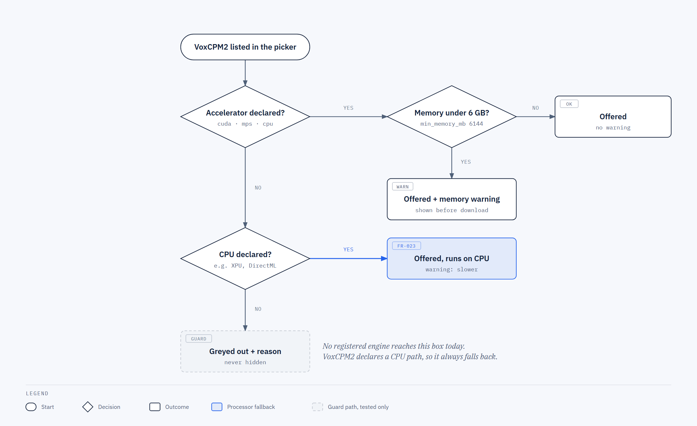
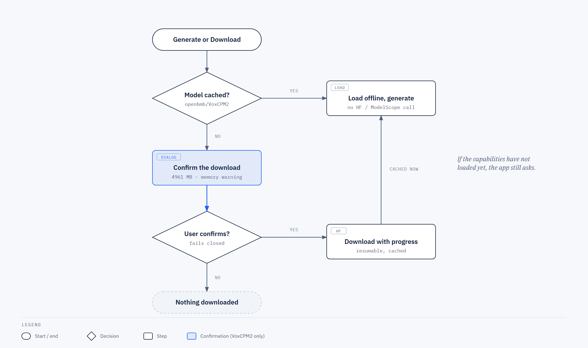

# VoxCPM2 in Voicebox

_A new speech engine you can use commercially, that speaks 30 languages including Arabic, and that can make a voice from a written description._

## The short version

Voicebox now has a ninth speech engine, VoxCPM2. Its licence (Apache-2.0) allows commercial use, it produces 48 kHz audio, and it covers 30 languages, Arabic among them. It can clone a voice from your existing voice profiles, and it can also build a voice from a sentence like "an old man, deep, slow and raspy voice", with no recording at all. Along the way we added three things that apply to every engine: a responsible-use notice when you create a profile, an "AI-generated by Voicebox" label inside every generated audio file, and profile exports that remember how a voice was made.

## Why we needed this

Anyone who wanted Arabic speech for something they planned to sell was stuck. The engine that handles a broad range of Arabic dialects has a non-commercial licence. The engine that is safe to use commercially only speaks Modern Standard Arabic. No amount of tuning fixes a licence. VoxCPM2 removes that trade-off.

Voice design is a bonus. Until now, the only way to get a custom voice was to supply a recording. Now you can describe one.

## The building blocks

| Concept | What it really is | Think of it as |
| --- | --- | --- |
| Engine | A model that turns text into speech. Voicebox now has nine. | A different singer you can hire |
| Voice profile | A saved voice. It can come from a recording (cloned), from an engine's built-in voices, or, new here, from a written description (designed). | A contact card for a voice |
| Voice description | A short sentence describing the voice you want. It can live on a designed profile, or be typed once in the generate box. | A casting brief |
| Capability endpoint | A backend address (`GET /models/engines`) the app asks "what can this engine do, and can this computer run it?" | The spec sheet on the box |
| Disclosure tag | A small note written into every generated WAV file's metadata: "AI-generated by Voicebox". The sound itself is untouched. | A label on the back of a photo |
| Download confirmation | A dialog that shows the 4961 MB size and waits for you before the download starts. VoxCPM2 is the only engine that asks, because it is much bigger than the rest. | "Are you sure? This is a big one." |

## Feature visuals

**How the pieces connect.** The app asks the capability endpoint what VoxCPM2 supports and whether this machine can run it. Generation then goes through the usual generation service, which calls the new VoxCPM2 backend and saves the result through the disclosure writer.

Source: [001-voxcpm2-tts-engine-architecture.html](./assets/diagrams/001-voxcpm2-tts-engine-architecture.html)

**One generation with a designed voice.** This answers two questions: which voice wins when you give Voicebox more than one hint, and how a long piece of text stays in the same voice from start to finish.

Source: [001-voxcpm2-tts-engine-sequence.html](./assets/diagrams/001-voxcpm2-tts-engine-sequence.html)

**Can this computer run it?** How the app decides whether to offer VoxCPM2, warn about it, or grey it out.

Source: [001-voxcpm2-tts-engine-availability.html](./assets/diagrams/001-voxcpm2-tts-engine-availability.html)

**First use.** What happens the first time someone picks VoxCPM2 and the model is not on disk yet.

Source: [001-voxcpm2-tts-engine-download.html](./assets/diagrams/001-voxcpm2-tts-engine-download.html)

## What it can do

### 1. Arabic speech you can sell

**Story.** Layla is producing an Arabic audiobook sample for a paying client. She opens Voicebox, picks VoxCPM2, chooses Arabic from the language list and pastes her text.

**What happens.** The language list comes from the engine itself: 30 languages, Arabic included. Seven of them (Burmese, Indonesian, Khmer, Lao, Tagalog, Thai and Vietnamese) are new to Voicebox and only VoxCPM2 offers them for now. Her pronunciation dictionary still applies, so the words she has fixed are said her way. The engine is shown as Apache-2.0 and fine for commercial use. The audio comes out at 48 kHz.

### 2. The first download asks first

**Story.** Layla has never used VoxCPM2 before, so the model is not on her laptop.

**What happens.** Before anything downloads, a dialog tells her it is 4961 MB and waits. If her graphics card has less than about 6 GB of memory, the same dialog warns her that generation may fail. It is only a warning; she can still go ahead. Once she confirms, a progress bar shows the download moving. If the app hasn't yet learned the engine's details from the backend, it still asks rather than skipping the question. After that first download, VoxCPM2 loads with the network switched off and never calls out to HuggingFace or ModelScope.

### 3. Cloning a voice she already has

**Story.** Omar has a voice profile of his own voice made from three short recordings. He selects it, picks VoxCPM2 and generates a line of text. Then he changes one word and generates again with the same seed.

**What happens.** All three recordings are used, not just the first. The preparation work on those recordings is done once and reused, so the second run starts faster. Same text, same voice and same seed give the same audio every time. In a blind test on the reviewer's machine, a listener picked the cloned voice as the real speaker in at least 4 of 5 tries.

### 4. Making a voice from a description

**Story.** Nadia wants a narrator voice for a short video but has no recording to clone. In the profile dialog she picks "Describe a voice", writes "A calm older woman with a low, warm voice" and saves.

**What happens.** She now has a designed profile. When she generates with it on VoxCPM2, the voice follows her description. She can also type a one-off description in the new "Voice description" box in the generate panel, which overrides the profile's own for that generation. The description can be in any language, and it doesn't have to match the language being spoken. An English description with Arabic text worked in our listening test.

A few rules keep this predictable:

- If the profile has a real recording, the recording wins. The generate box says plainly that the description is not being used.
- A one-off description is saved with the generation, so Retry and Regenerate use it again.
- Long text keeps one voice. Without a recording, each chunk of a long text would otherwise come out as a slightly different person. Voicebox now makes the first chunk from the description, then uses that chunk as a temporary recording for the rest. The temporary file is deleted when the generation ends, even if it is cancelled.
- The "Voice description" box is separate from the existing "delivery instructions" box. Describing who is speaking and directing how they speak are different jobs.

### 5. Fine-tuning quality

**Story.** Omar thinks a line sounds a little flat.

**What happens.** VoxCPM2 has two advanced settings, Guidance (default 2.0) and Quality steps (default 10), already set to sensible values. He can change them for one generation, and values outside the allowed range are refused. Retry, Regenerate and the `/speak` API go back to the defaults, because the settings are not saved with a generation yet.

### 6. Knowing up front whether a machine can run it

**Story.** Sam uses a laptop with an Intel Arc graphics chip, which VoxCPM2 cannot use.

**What happens.** VoxCPM2 is still offered, with a note that it will run on the processor and be slower. That is by design: every Voicebox engine is expected to fall back to the processor. For an engine that could not run at all, the picker would show it greyed out with the reason, never hidden, and the backend would refuse the request with that reason instead of crashing. No engine hits that case today, so it is covered by tests rather than by real hardware.

### 7. Audio that says what it is

**Story.** Layla sends her client the WAV file.

**What happens.** The file carries an "AI-generated by Voicebox" comment in its metadata. That goes for every engine and every way audio comes out of Voicebox: saved generations, `/speak`, the streaming endpoint and effects previews. Recordings Layla made or uploaded herself, like her voice samples, are never labelled as AI-generated.

### 8. Profile export that remembers where a voice came from

**Story.** Nadia exports her designed profile to use on another computer.

**What happens.** The export now records the voice type, the description and the default engine, and importing restores them. Before this, every imported profile came back as a cloned one. A designed profile with no audio can now be exported. Older exports still import as they always did. Generation exports now also keep the engine, the model size and the voice description, and imports check those values the same way the API does.

## Who does what

| Who | Their part |
| --- | --- |
| The user | Picks the engine, confirms the download, chooses or creates a profile, writes descriptions |
| The app | Shows only what the capability endpoint says the engine supports, asks before the download, shows warnings and the responsible-use notice |
| The capability endpoint | Answers from the engine's own declaration and the detected hardware. It never downloads or loads a model |
| The generation service | Decides which voice source wins, checks advanced settings, refuses an engine the machine cannot run |
| The VoxCPM2 backend | Loads the model (offline once cached), clones or designs the voice, generates |
| The disclosure writer | Tags generated audio and leaves the user's own recordings alone |

## What this phase deliberately does not do

- No streaming output. VoxCPM2 works in chunks like the other engines.
- Only one model size. VoxCPM 1.5 and the 0.5B model are not offered.
- The other engines still use their own hand-kept language and hardware lists in the app. Only VoxCPM2 reads from the new capability endpoint for now.
- Advanced settings are not saved with a generation.
- VoxCPM2's denoiser and its separate reference-only cloning mode are left out.

## Caveats and pending decisions

- **One listening check is still open.** The recording from the fix for long designed text (review item I3) is waiting for the owner to listen to it. This is a merge gate.
- **Apple Silicon is untested.** The vendor documents it, but no Mac was available.
- **Linux**: setup and the engine list were checked in WSL. No real VoxCPM2 generation was run on Linux.
- **Three older engines were not re-run** (chatterbox, chatterbox_turbo and tada-3b-ml) because their models were not downloaded. Their code was not changed, and the shared code paths passed with the eight engines that were tested. The owner accepted this risk.
- **Speed on the processor is slow.** The probe measured about 2.6 to 3 seconds of work per second of audio on a 24-core CPU, against roughly real time on an RTX 5070.

## How confident should you be?

Fairly confident, with the gaps above named.

- The backend test suite was run locally on Windows with an RTX 5070: 1187 tests, 1 failure, 0 errors, 9 skipped. The single failure, `test_hf_progress_tracker`, fails on `main` too, so this feature did not cause it.
- The type check and the web build both pass. Ruff shows no new problems compared with `main`.
- Two rounds of code review, one reviewer for the backend and one for the app, found 0 blocking issues after fixes. Every fix has a failing test before it and a passing test after it.
- A person listened to the Arabic and designed-voice samples and judged them good, walked through the UI, and ran the blind cloning test (at least 4 of 5).
- All 56 planned tasks are done and closed on the tracking issue.

## Glossary

- **Accelerator**: the hardware that runs the model: an NVIDIA card (CUDA), Apple Silicon (MPS), or the processor (CPU).
- **Apache-2.0**: an open licence that allows commercial use.
- **Chunk**: a piece of a long text. Engines generate long text a piece at a time.
- **Cloning**: making speech in a voice taken from a recording.
- **Designed profile**: a voice profile made from a written description instead of a recording.
- **48 kHz**: the audio sample rate. Higher means crisper sound.
- **Seed**: a number that fixes the randomness, so the same inputs give the same audio.
- **WAV metadata**: text stored inside an audio file alongside the sound, such as a comment or the name of the software that made it.

---

- Technical record: [CHANGELOG.md](./CHANGELOG.md)
- Spec and evidence: [specs/001-voxcpm2-tts-engine/](../../specs/001-voxcpm2-tts-engine/)
- Diagram sources: [architecture](./assets/diagrams/001-voxcpm2-tts-engine-architecture.html), [sequence](./assets/diagrams/001-voxcpm2-tts-engine-sequence.html), [availability](./assets/diagrams/001-voxcpm2-tts-engine-availability.html), [download](./assets/diagrams/001-voxcpm2-tts-engine-download.html)
